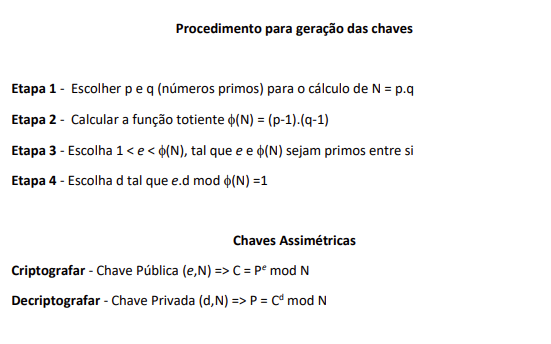

# N1B1-UDP-RSA
# Caio de Morais    RA: 082180015
# Juniior Almeida   RA: 082180035
# João Guilherme    RA: 082180011
# Wagner Olimpio    RA: 082180033

### Atividade
Construa o algoritmo com a linguagem de programação de sua preferência, ele deve
escolher dois valores aleatórios para p e q, gerar as chaves pública e privada de acordo com os
quatro passos apresentados. O algoritmo deve ser capaz de criptografar e decriptografar a frase
“The information security is of significant importance to ensure the privacy of communications”.

